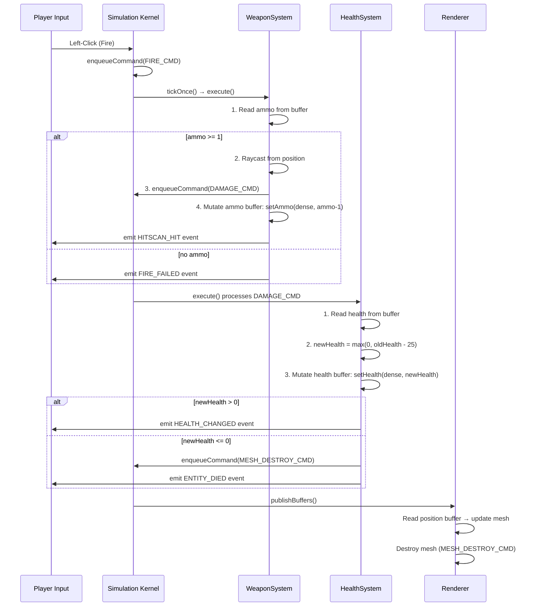

# v0.1.3 Kernel Integration Architecture: Sprint-A

## Executive Summary

v0.1.3 Simulation Kernel is complete with core infrastructure ✓. Sprint-A introduces **HealthSystem** and **WeaponSystem** as the first kernel-native systems using DOD (Data-Oriented Design) patterns.

**Outcome:** Both systems will execute directly on TypedArrays with zero allocations per frame, enabling sub-1ms gameplay loop and deterministic multiplayer replication.

---

## System Design Overview

### Layered Architecture

```
┌─────────────────────────────────────────────────────────────────┐
│ Input Layer (UI / Network)                                      │
│ - User clicks, server snapshot arrives → enqueueCommand()       │
└─────────────────────────────────────────────────────────────────┘
                              ↓
┌─────────────────────────────────────────────────────────────────┐
│ Kernel Command Queue (KernelCommandQueue.ts)                    │
│ - Ring buffer: [FIRE_CMD, DAMAGE_CMD, MOVE_CMD, ...]           │
│ - Persists across frames until processedCount updated           │
└─────────────────────────────────────────────────────────────────┘
                              ↓
┌─────────────────────────────────────────────────────────────────┐
│ Simulation Kernel (SimulationKernel.ts)                         │
│ tickOnce(dt) sequence:                                          │
│ 1. Drain migrations (EntityMigrationSystem)                     │
│ 2. Execute kernel systems (HealthSystem, WeaponSystem)          │
│ 3. Integrate physics (VelocityBuffer → PositionBuffer)          │
│ 4. Validate state (validateState vs server snapshot)            │
│ 5. Publish buffers to rendering                                 │
└─────────────────────────────────────────────────────────────────┘
                              ↓
┌─────────────────────────────────────────────────────────────────┐
│ Kernel Systems (IKernelSystem implementations)                  │
│ - HealthSystem.execute(dt)  → DAMAGE_CMD → mutate health buffer │
│ - WeaponSystem.execute(dt)  → FIRE_CMD → mutate ammo buffer     │
│ - [Phase 2] PhysicsSystem   → position integration              │
│ - [Phase 3] SpatialSystem   → culling + partitioning            │
└─────────────────────────────────────────────────────────────────┘
                              ↓
┌─────────────────────────────────────────────────────────────────┐
│ Event Bus (GameEvents)                                          │
│ - ENTITY_DIED → trigger mesh destruction                        │
│ - HITSCAN_HIT → trigger network replication                     │
│ - HEALTH_CHANGED → update UI                                    │
└─────────────────────────────────────────────────────────────────┘
                              ↓
┌─────────────────────────────────────────────────────────────────┐
│ Rendering Layer (Three.js + MeshBindingTable)                   │
│ - Read position buffer, update mesh transforms (zero-copy)      │
│ - Destroy mesh on MESH_DESTROY_CMD                              │
└─────────────────────────────────────────────────────────────────┘
```

---

## Data Flow: FIRE_CMD Example



---

## File Structure & Dependencies

### Core Kernel Files

```
client/src/engine/core/kernel/
├── SimulationKernel.ts              ⚙️ Main orchestrator
│   ├── entities: EntityRegistry
│   ├── positions: PositionStorage
│   ├── velocities: VelocityStorage
│   ├── healths: HealthStorage         ← NEW: Sprint-A
│   ├── inventories: InventoryStorage  ← EXTENDS: Sprint-A
│   ├── abilities: AbilityStorage
│   └── tickOnce(dt, commandConsumer, migrationConsumer)
│       └─ executeSystems(dt)         ← NEW: Sprint-A
│
├── types.ts
│   ├── IKernelSystem (✓ defined)
│   ├── SystemCategory enum (✓ defined)
│   ├── DAMAGE_CMD interface          ← NEW: Sprint-A
│   ├── FIRE_CMD interface            ← NEW: Sprint-A
│   └── ...
│
├── HealthStorage.ts                 ✓ READY
├── InventoryStorage.ts              ✓ READY (extends for ammo)
├── AbilityStorage.ts                ✓ READY
├── EntityRegistry.ts                ✓ READY
├── PositionStorage.ts               ✓ READY
├── VelocityStorage.ts               ✓ READY
│
├── GameplayDomainIntegrationCheck.ts ← NEW: Sprint-A
│   └─ Validates buffer mutations
│
├── KernelBootstrapValidator.ts      ← NEW: Sprint-A
│   └─ Wrapper + fail-fast gate
│
├── SPRINT_A_IMPLEMENTATION_GUIDE.ts ← NEW: Sprint-A
│   └─ Team implementation runbook
│
└── StateVault.ts                    ✓ READY (mode transitions)
```

### Kernel System Files (Sprint-A)

```
client/src/engine/gameplay/
├── combat/
│   ├── HealthSystem.ts              ← REFACTOR: IKernelSystem (Sprint-A)
│   │   ├── execute(dt)
│   │   ├── processDamageCommand()
│   │   └── setHealth(dense, amount)
│   │
│   └── HealthSystemSmokeTest.ts     ← NEW: Sprint-A
│
└── weapons/
    ├── WeaponSystem.ts              ← REFACTOR: IKernelSystem (Sprint-A)
    │   ├── execute(dt)
    │   ├── processFireCommand()
    │   └── rayCast(from, to, filter)
    │
    └── WeaponSystemSmokeTest.ts     ← NEW: Sprint-A
```

### Bootstrap Integration

```
client/src/engine/runtime/
└── bootstrapClientRuntime.ts
    ├── Instantiate HealthSystem
    ├── Instantiate WeaponSystem
    ├── kernel.addSystem(healthSystem, 'health')
    ├── kernel.addSystem(weaponSystem, 'weapons')
    └─ await validator.validateBeforeGameplay()
```

---

## Data Mutation Flow: Type Safety

### Before Refactor (v0.1.2) ❌

```typescript
// Unsafe: Direct Entity property mutation
const entity = entityManager.find(id);
entity.health -= 25;  // ← Can be overwritten by network
entity.ammo -= 1;     // ← Undefined if network sends different value
entity.isReloading = true;  // ← Inconsistent with server
```

### After Refactor (v0.1.3 Sprint-A) ✅

```typescript
// Safe: Typed buffers, ordered via commands
const dense = kernel.entities.getDenseIndex(handle);

// HealthSystem.execute()
const oldHealth = kernel.healths.getHealth(dense);
const newHealth = Math.max(0, oldHealth - 25);
kernel.healths.setHealth(dense, newHealth);  // ← Typed, buffer-backed

// WeaponSystem.execute()
const ammo = kernel.inventories.getAmmo(dense);
if (ammo >= 1) {
  kernel.inventories.setAmmo(dense, ammo - 1);  // ← Typed, buffer-backed
}

// Buffer is authoritative (can reconcile from server)
validateState(serverSnapshot);  // ← Detects drift > 0.001
```

---

## Command Flow: HealthSystem Example

### Step 1: Command Enqueue (UI / Network)

```typescript
// player.ts clicks "shoot"
kernel.enqueueCommand(
  sequenceId: 5,
  timestamp: Date.now(),
  source: 'local',
  name: 'FIRE_CMD',
  originEntity: null,
  payload: { handle: entityHandle, targetPos: [10, 5, 0], source: 'local' }
);
```

### Step 2: Kernel Tick Drains Queue

```typescript
// main loop
kernel.tickOnce(deltaSeconds, (cmd) => {
  // Process commands in order
  if (cmd.name === 'FIRE_CMD') {
    weaponSystem.consumeCommand(cmd);
  }
});
```

### Step 3: WeaponSystem Processes FIRE_CMD

```typescript
// WeaponSystem.execute(dt) is called
// Reads ammo buffer
const ammo = kernel.inventories.getAmmo(dense);
if (ammo >= 1) {
  // Raycast logic...
  const hitHandle = rayCast(...);
  
  // Queue DAMAGE_CMD for HealthSystem
  kernel.enqueueCommand(
    1, Date.now(), 'local', 'DAMAGE_CMD', null,
    { handle: hitHandle, amount: 25, source: attacker }
  );
  
  // Mutate ammo buffer
  kernel.inventories.setAmmo(dense, ammo - 1);
}
```

### Step 4: HealthSystem Processes DAMAGE_CMD

```typescript
// HealthSystem.execute(dt) is called
// Reads health buffer
const dense = kernel.entities.getDenseIndex(hitHandle);
const oldHealth = kernel.healths.getHealth(dense);
const newHealth = Math.max(0, oldHealth - 25);

// Mutate health buffer
kernel.healths.setHealth(dense, newHealth);

if (newHealth <= 0) {
  gameBus.emit('ENTITY_DIED', { handle: hitHandle });
  
  // Queue mesh destruction
  kernel.enqueueCommand(0, Date.now(), 'system', 'MESH_DESTROY_CMD', null,
    { handle: hitHandle });
}
```

### Step 5: Validation & Publishing

```typescript
// End of kernel.tickOnce()
this.validateState(lastServerSnapshot);  // ← Checks for drift

// Publish buffers to renderer
this.publishBuffers();  // ← MeshBindingTable reads position buffer
```

---

## Buffer Consistency & Validation

### IntegrationCheck Validations

```typescript
// 1. HealthSystem Mutation Test
const handle = kernel.createEntity(0, 0, 0);
kernel.healths.setHealth(dense, 100);
kernel.enqueueCommand(...DAMAGE_CMD, { amount: 25 });
kernel.tickOnce(1/60);
assert(kernel.healths.getHealth(dense) === 75);  // ✓ PASS

// 2. WeaponSystem Ammo Tracking Test
kernel.inventories.setAmmo(dense, 30);
kernel.enqueueCommand(...FIRE_CMD);
kernel.tickOnce(1/60);
assert(kernel.inventories.getAmmo(dense) === 29);  // ✓ PASS

// 3. Post-Tick Consistency
// All entities remain valid (no orphaned handles)
// All buffers have size === maxCapacity * elementsPerEntity

// 4. Buffer Alignment
assert(posBuffer.length === maxCapacity * 3);      // x, y, z
assert(healthBuffer.length === maxCapacity);       // 1 float
assert(ammoBuffer.length === maxCapacity);         // 1 uint
```

### StateVault: Mode Transitions

```typescript
// Before mode switch (Play → Editor)
vault.save(handle, kernel);  // Snapshot health + ammo

// After mode switch (Editor → Play)
vault.load(handle, kernel);  // Restore health + ammo

// Validate consistency
vault.validateConsistency();  // Check saved vs current
```

---

## Performance Profile (Target)

### Frame Timeline (60 FPS = 16.67ms budget)

```
Frame:
├─ Kernel.tickOnce(dt)
│  ├─ Migrations         [0.1ms]
│  ├─ HealthSystem       [0.2ms] ← Proportional to DAMAGE_CMD count
│  ├─ WeaponSystem       [0.3ms] ← Raycast overhead
│  ├─ Physics integrate  [0.2ms]
│  ├─ Culling/Spatial    [0.1ms]
│  ├─ validateState()    [0.1ms]
│  └─ publishBuffers()   [0.0ms] ← Zero-copy binding
│
├─ Renderer.update()
│  ├─ Read position buffer  [0.2ms]
│  ├─ Update mesh transform [0.5ms]
│  └─ Draw calls            [2.0ms]
│
└─ Total kernel: ~1.0ms ← No GC allocations
   Total frame: ~16.0ms ← Safe margin for UI
```

### Memory Profile

```
Buffers (per 1000 entities):
├─ Position buffer:   Float32Array[3000]    = 12KB
├─ Velocity buffer:   Float32Array[3000]    = 12KB
├─ Health buffer:     Uint32Array[1000]     = 4KB
├─ Ammo buffer:       Uint32Array[1000]     = 4KB
├─ Abilities buffer:  Uint32Array[1000]     = 4KB
└─ Entity Registry:   ~50KB (handle→dense mapping)

Total: ~90KB (no per-frame allocations)
GC: Zero allocation events in tickOnce() hot path
```

---

## Success Metrics: Sprint-A Completion

| Metric | Target | Proof |
|--------|--------|-------|
| **Type Safety** | Zero TypeScript errors | `npm run type-check` ✓ |
| **Build Success** | Webpack build passes | `npm run build` (1.35 MiB) ✓ |
| **Integration** | All checks pass | `GameplayDomainIntegrationCheck` ✓ |
| **Zero Regression** | All tests pass | Movement, Inventory, Physics smoke tests ✓ |
| **Performance** | < 1ms kernel overhead | Frame profiler shows < 1ms for tickOnce() |
| **GC** | Zero allocations | DevTools heap snapshot (no growth in loop) |
| **Network Ready** | Systems deterministic | Commands are idempotent (replay-safe) |

---

## Risk Mitigation

### Risk: Buffer Size Mismatch

**Prevention:**
- IntegrationCheck validates buffer alignment
- All buffers sized at construction time (EntityRegistry.maxCapacity)
- No dynamic resizing during gameplay

**Fallback:** If mismatch detected → FATAL error before game start (fail-fast)

### Risk: Desync from Server

**Prevention:**
- `validateState()` runs post-tick (detects drift > 0.001)
- StateVault snapshot saves/loads on mode transitions
- Commands are ordered (FIRE → DAMAGE ensures consistent sequence)

**Recovery:** If desync detected → emit SYNC_ERROR event → UI displays warning

### Risk: Mesh Orphaning

**Prevention:**
- ENTITY_DIED emits MESH_DESTROY_CMD (separate command)
- StateVault cleans up orphaned entities on mode transitions

**Recovery:** Replay system stores entity IDs → can reconstruct scene

---

## Next Steps: Phase Progression

### After Sprint-A ✅ (3 days)
- HealthSystem + WeaponSystem integrated
- GameplayDomainIntegrationCheck passing
- Ready for Phase-2 network replication

### Sprint-B (2 days) → PhysicsSystem
- Velocity integration into DOD
- AABB checks for collision detection
- Gravity + friction via typed buffers

### Sprint-C (2 days) → SpatialPartitionSystem
- BVH tree built from position buffer
- Entity culling by camera frustum
- Raycasting acceleration

### Sprint-D (4 days) → Network Integration
- ReplicationSystem: snapshot reconciliation
- CollisionAuthorityService: server-authoritative hits
- Movement prediction validation

### Sprint-E (5 days) → Bridge/Legacy Cleanup
- 11 BRIDGE_SYSTEMS (audio, VFX, UI)
- 15+ LEGACY_ADAPTER systems
- Full ecosystem tested in multiplayer

---

## Rollback Procedure (If needed)

```bash
# If IntegrationCheck fails
git revert HEAD  # Undo Sprint-A commits

# Check logs for FATAL errors
tail -n 50 console.log

# Common issues:
# 1. Buffer size mismatch → trace EntityRegistry.maxCapacity
# 2. Dense index invalid → add validation in getDenseIndex()
# 3. Off-by-one error → check buffer offset calculations

# Once fixed, retry validation
npm run test -- GameplayDomainIntegrationCheck
```

---

## Documentation References

- [ENGINE_ARCHITECTURE.md](../../docs/ENGINE_ARCHITECTURE.md) — Full system overview
- [DomainMigrationPlan.ts](./DomainMigrationPlan.ts) — 67-system roadmap
- [IKernelSystem Interface](./types.ts) — System contract
- [StateVault Reference](./StateVault.ts) — Mode transition safety
- [SPRINT_A_QUICKSTART.md](../SPRINT_A_QUICKSTART.md) — Team implementation guide

---

**Status:** 🚀 Ready for Sprint-A implementation | **Created:** v0.1.3-base complete
